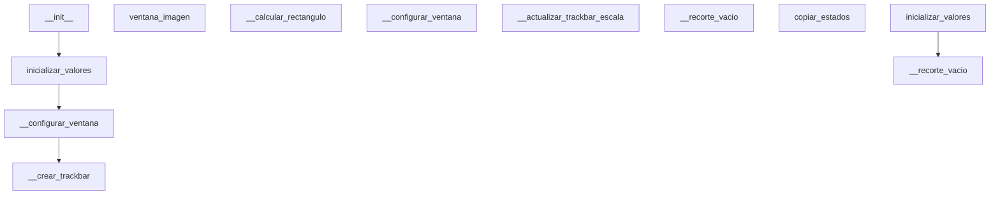
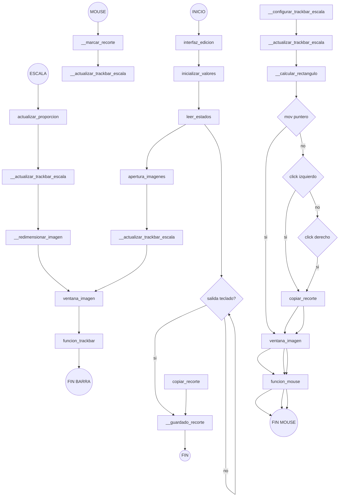

```mermaid
flowchart TD;

A[__init__]-->B[inicializar_valores]-->C[__configurar_ventana]-->D[__crear_trackbar] 

K3[ventana_imagen]

O2[__calcular_rectangulo]

C2[__configurar_ventana]


N2[__actualizar_trackbar_escala]

I2[__recorte_vacio]         

E[copiar_estados]


B2[inicializar_valores] --> I[__recorte_vacio]


```
----------
----------

```mermaid
flowchart TD;


id1((ESCALA))-->J

id2((MOUSE))-->M

id3((INICIO)) -->T


id7((FIN MOUSE)) 
id8((FIN BARRA)) 
id9((FIN)) 

F[leer_estados] --> G[apertura_imagenes] 

G[apertura_imagenes]--> N3[__actualizar_trackbar_escala] -->K[ventana_imagen]


J[actualizar_proporcion]--> N4[__actualizar_trackbar_escala] -->R[__redimensionar_imagen]--> K[ventana_imagen] --> L[funcion_trackbar] -->id8 

M[__marcar_recorte] --> N2[__actualizar_trackbar_escala]
N-->O[__calcular_rectangulo] --> IF1{mov puntero}
IF1 -->|si| K2[ventana_imagen] --> P[funcion_mouse]-->id7
IF1 -->|no| IF2{click izquierdo}-->|si| Q[copiar_recorte] -->K2[ventana_imagen]--> P[funcion_mouse] -->id7
IF2 -->|no| IF3{click derecho}-->|si| Q[copiar_recorte] -->K2[ventana_imagen]--> P[funcion_mouse] -->id7


AA[__configurar_trackbar_escala] -->N[__actualizar_trackbar_escala]


T[interfaz_edicion] --> B2[inicializar_valores] --> F[leer_estados] ---->IF5{salida teclado?}---->|si| U


IF5{salida teclado?}---->|no|IF5

Q2[copiar_recorte]-->U[__guardado_recorte]-->id9

```

